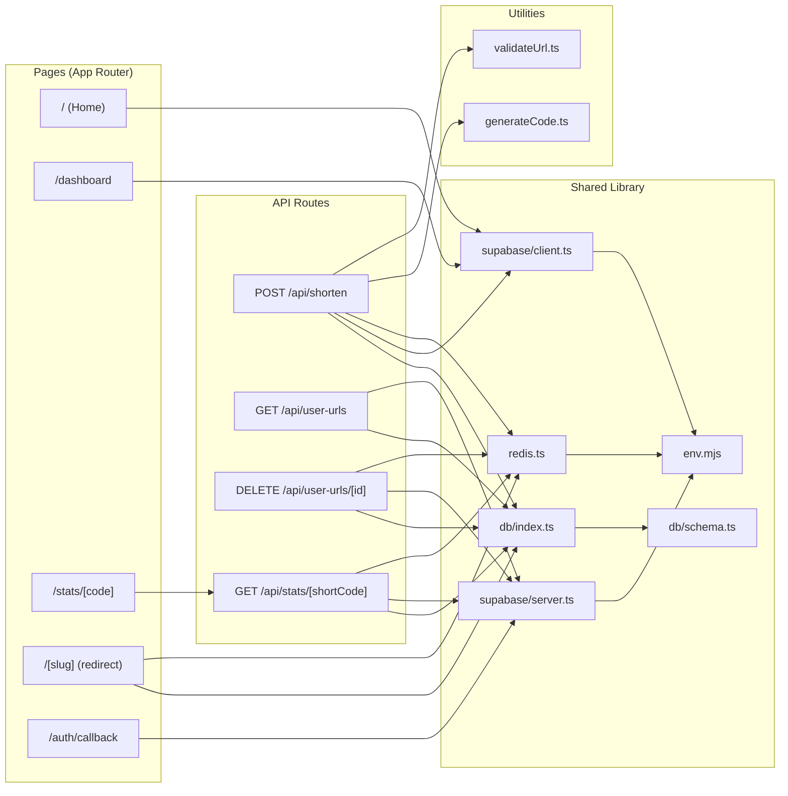
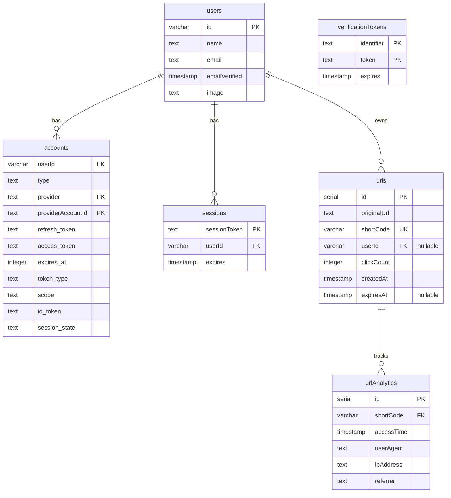
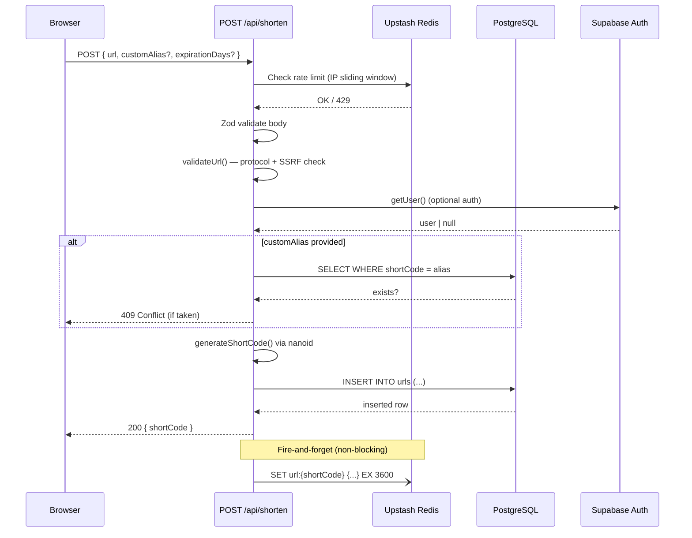
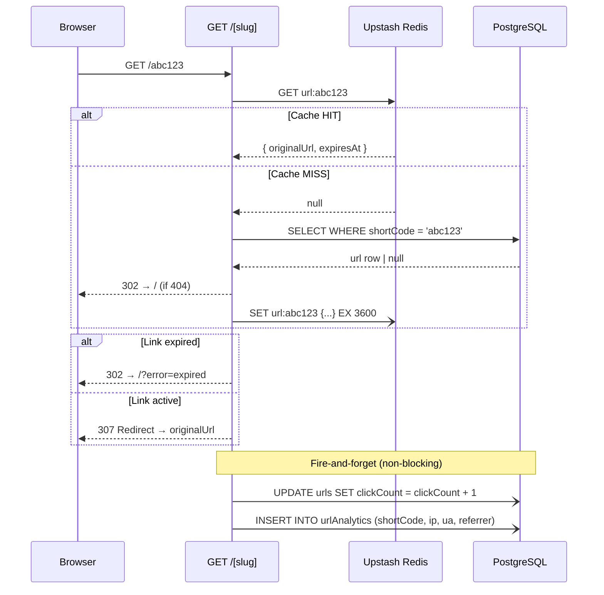
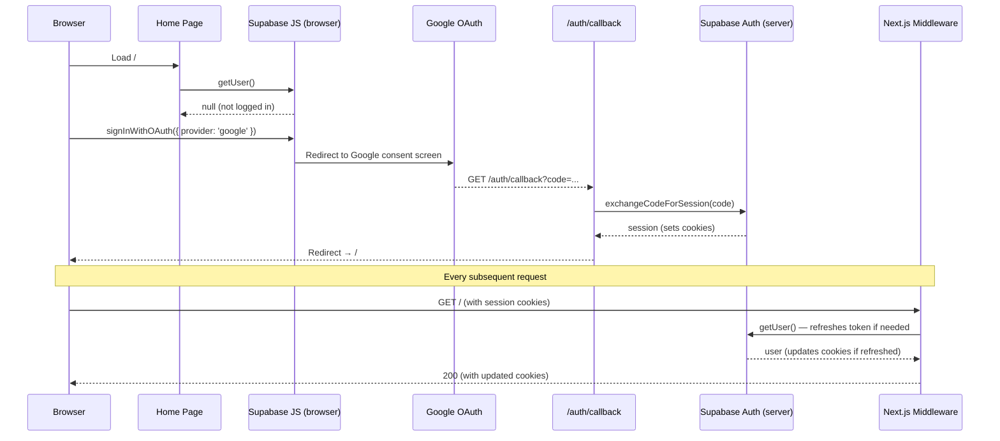
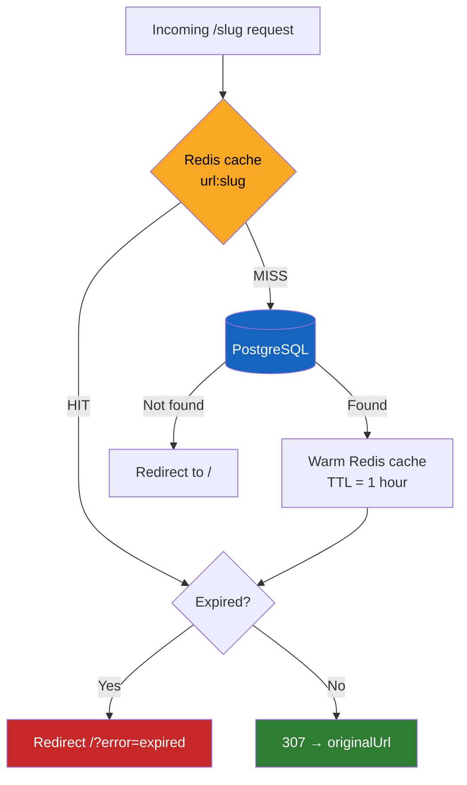
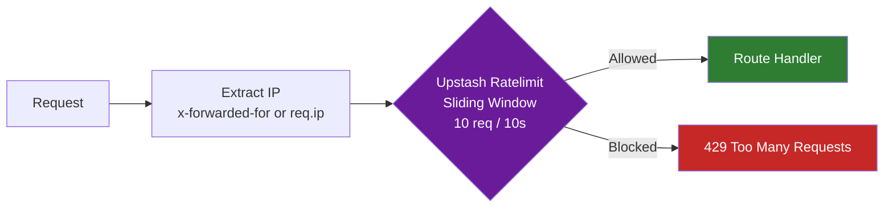
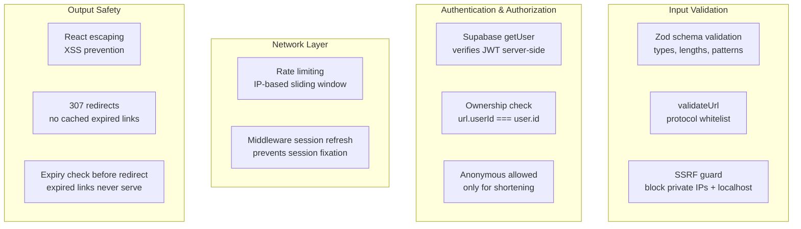
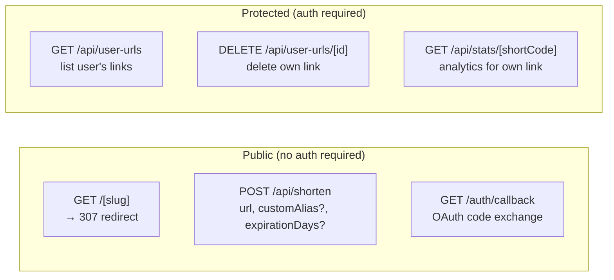

# Shrinkit — Architecture & Build Story

> A production-grade URL shortener built with Next.js 14, Supabase, Drizzle ORM, and Upstash Redis. This document covers every architectural decision, the trade-offs behind them, and why things are built the way they are.

---

## Table of Contents

1. [The Problem](#the-problem)
2. [Tech Stack](#tech-stack)
3. [System Architecture](#system-architecture)
4. [Database Design](#database-design)
5. [Request Lifecycle](#request-lifecycle)
6. [Authentication Flow](#authentication-flow)
7. [Caching Strategy](#caching-strategy)
8. [Rate Limiting](#rate-limiting)
9. [Security Model](#security-model)
10. [API Design](#api-design)
11. [Trade-offs & Decisions](#trade-offs--decisions)
12. [Known Limitations](#known-limitations)

---

## The Problem

URL shorteners look simple on the surface: take a long URL, spit out a short one. But building one that's *actually production-ready* surfaces a lot of interesting problems fast:

- How do you make redirects fast enough that users don't notice the hop?
- How do you prevent abuse (spam, SSRF attacks, rate abuse)?
- How do you let anonymous users shorten links while giving authenticated users extra power?
- How do you track analytics without slowing down the redirect itself?
- How do you handle link expiration without a cron job?

Shrinkit answers all of these. Here's how.

---

## Tech Stack

| Layer | Tool | Why |
|---|---|---|
| Framework | [Next.js 14](https://nextjs.org) (App Router) | Full-stack in one repo; edge-compatible middleware; RSC for zero-JS pages |
| Database | [PostgreSQL](https://www.postgresql.org) via [Supabase](https://supabase.com) | Managed Postgres with connection pooling, auth, and realtime built in |
| ORM | [Drizzle ORM](https://orm.drizzle.team) | Type-safe SQL that compiles to raw queries — no magic, no runtime overhead |
| Auth | [Supabase Auth](https://supabase.com/docs/guides/auth) + [`@supabase/ssr`](https://supabase.com/docs/guides/auth/server-side/overview) | OAuth (Google) with SSR-safe session management via cookies |
| Cache / Rate Limit | [Upstash Redis](https://upstash.com) + [`@upstash/ratelimit`](https://github.com/upstash/ratelimit) | Serverless-native Redis; HTTP-based so it works in Edge Runtime |
| Short Code Gen | [nanoid](https://github.com/ai/nanoid) | Cryptographically random, URL-safe, 6-char codes = 56 billion combinations |
| Styling | [Tailwind CSS](https://tailwindcss.com) | Utility-first; no CSS files to maintain |
| QR Codes | [qrcode.react](https://github.com/zpao/qrcode.react) | Zero-config SVG QR generation in the browser |
| Validation | [Zod](https://zod.dev) | Runtime type safety at API boundaries |
| Icons | [Lucide React](https://lucide.dev) | Tree-shakeable, consistent icon set |
| Language | [TypeScript](https://www.typescriptlang.org) | End-to-end type safety across DB schema → API → UI |

---

## System Architecture

### High-Level Overview

```mermaid
graph TB
    subgraph Client["Browser"]
        UI[React UI<br/>Next.js Client Components]
    end

    subgraph Next["Next.js Server (Vercel / Node)"]
        MW[Middleware<br/>Session Refresh]
        HP[Home Page<br/>RSC + Client]
        DB_PAGE[Dashboard Page<br/>Client Component]
        SLUG[/slug/ Route Handler<br/>Redirect Logic]
        API_SHORTEN[POST /api/shorten]
        API_URLS[GET /api/user-urls]
        API_DELETE[DELETE /api/user-urls/:id]
        API_STATS[GET /api/stats/:code]
        API_CALLBACK[GET /auth/callback]
    end

    subgraph Infra["External Infrastructure"]
        SUPA_AUTH[Supabase Auth<br/>OAuth Provider]
        SUPA_DB[(Supabase PostgreSQL<br/>Pooled Connection)]
        REDIS[(Upstash Redis<br/>Cache + Rate Limit)]
        GOOGLE[Google OAuth]
    end

    UI -->|Every Request| MW
    MW -->|getUser / refresh session| SUPA_AUTH
    UI --> HP
    UI --> DB_PAGE
    UI -->|short link click| SLUG

    SLUG -->|1. Check cache| REDIS
    SLUG -->|2. Cache miss → query| SUPA_DB
    SLUG -->|3. Fire-and-forget analytics| SUPA_DB

    API_SHORTEN -->|Rate limit check| REDIS
    API_SHORTEN -->|Auth check| SUPA_AUTH
    API_SHORTEN -->|Insert URL| SUPA_DB
    API_SHORTEN -->|Warm cache| REDIS

    API_URLS -->|Auth check| SUPA_AUTH
    API_URLS -->|Query user's links| SUPA_DB

    API_DELETE -->|Rate limit + Auth| REDIS
    API_DELETE -->|Delete row + evict cache| SUPA_DB

    API_STATS -->|Rate limit + Auth| REDIS
    API_STATS -->|Query analytics| SUPA_DB

    API_CALLBACK -->|Exchange OAuth code| SUPA_AUTH
    SUPA_AUTH <-->|OAuth flow| GOOGLE
```

### Component Ownership Map



---

## Database Design

### Entity Relationship Diagram



### Schema Decisions

**Why `shortCode` as VARCHAR not a hash?**
nanoid generates a 6-character alphanumeric code. Storing it as a VARCHAR with a `UNIQUE` constraint means:
- Single index for all lookups
- Human-readable and shareable
- No collision resolution complexity (nanoid space = 56B combinations)

**Why nullable `userId` on `urls`?**
Anonymous shortening is a core feature — users shouldn't need to sign up just to shorten a link. When they do sign in, their links are linked to their account. The nullable FK enables both modes without a separate table.

**Why a separate `urlAnalytics` table?**
Putting analytics data (referrer, IP, UA) in the `urls` row would mean updating a row on every click — expensive under high load. A separate append-only table scales better; each click is an `INSERT`, not an `UPDATE` of a hot row.

**The `clickCount` counter on `urls`**
This looks redundant with `urlAnalytics`, and it is — by design. Reading the click count from `urlAnalytics` requires a `COUNT(*)` query. The denormalized `clickCount` on the `urls` row is incremented atomically and makes dashboard rendering a simple `SELECT`, not an aggregation.

---

## Request Lifecycle

### Short URL Creation



### Redirect (The Hot Path)



**Why 307 (Temporary Redirect) and not 301?**

A 301 is cached *permanently* by browsers. If a link ever expires or is deleted, users would still be redirected by their browser cache indefinitely. The 307 means the browser always checks back — essential for expiration logic to work.

---

## Authentication Flow



**Why does the middleware call `getUser()` on every request?**

Supabase JWTs have a 1-hour expiry. The middleware's job is to silently refresh the access token using the refresh token stored in cookies, *before* any page or API route runs. Without this, users would be randomly logged out after an hour. The `getAll`/`setAll` cookie pattern in the middleware is atomic — it avoids the `ERR_HTTP_HEADERS_SENT` error that the older individual `get`/`set`/`remove` pattern caused.

---

## Caching Strategy



**Cache key schema:** `url:{shortCode}` → `{ originalUrl: string, expiresAt: string | null }`

**TTL choice — why 1 hour?**
- Short enough that deleted/expired links don't serve stale data for long
- Long enough to absorb traffic spikes for viral links
- Links don't change after creation (immutable), so stale reads are low-risk

**What happens on delete?**
The `DELETE /api/user-urls/[id]` endpoint fires a cache eviction (`redis.del("url:{shortCode}")`) alongside the DB delete — fire-and-forget. In the worst case, a deleted link still redirects for up to an hour (until TTL expires). Acceptable for a non-critical scenario.

---

## Rate Limiting



**Applied to:** `POST /api/shorten`, `DELETE /api/user-urls/[id]`, `GET /api/stats/[shortCode]`

**Not applied to:** `GET /[slug]` — the redirect hot path. Rate limiting the redirect would add latency to every link click, which defeats the purpose. Redis cache already absorbs burst traffic on popular links.

**Sliding window vs. fixed window:**
A fixed window resets every N seconds, allowing a burst of 2× the limit right at the window boundary. A sliding window smooths this out — at any 10-second window, you can't exceed 10 requests, period.

---

## Security Model



**SSRF Prevention**
The `validateUrl` utility blocks:
- `http://localhost`, `http://127.0.0.1`, `http://[::1]`
- RFC 1918 private ranges: `10.x.x.x`, `192.168.x.x`, `172.16-31.x.x`

Without this, an attacker could create a short link pointing to `http://169.254.169.254/` (AWS metadata endpoint) or internal services, and then use the redirect to probe the internal network.

**Why auth on stats/delete but not on the redirect?**
The redirect is the public product — it must be fast and frictionless. Stats and deletion are power-user features that require knowing you own the link. The ownership check (`url.userId === user.id`) prevents one user from deleting or reading another user's analytics.

---

## API Design

### Endpoints



### Error Response Shape

All API errors follow a consistent shape:

```json
{ "error": "Human-readable message" }
```

With HTTP status codes:
- `400` — validation failure
- `401` — not authenticated
- `403` — authenticated but not the owner
- `404` — resource not found
- `409` — custom alias already taken
- `429` — rate limited

---

## Trade-offs & Decisions

### 1. Fire-and-Forget Analytics

The redirect route (`/[slug]`) does *not* `await` the analytics writes:

```typescript
// Non-blocking — redirect fires immediately
db.update(urls)
  .set({ clickCount: sql`${urls.clickCount} + 1` })
  .where(eq(urls.shortCode, slug))
  .catch(() => {});

db.insert(urlAnalytics)
  .values({ shortCode: slug, ... })
  .catch(() => {});
```

**Why:** Awaiting DB writes would add 20–100ms to every redirect. Users clicking a link should not feel the analytics overhead.

**The downside:** Under crash scenarios, you lose the click record. For a commercial product with SLAs, you'd use a message queue (e.g., [Upstash QStash](https://upstash.com/docs/qstash/overall/getstarted)) to guarantee delivery. For this project, eventual consistency with rare loss is acceptable.

---

### 2. Drizzle ORM over Prisma

[Prisma](https://www.prisma.io) is the more popular choice, but Drizzle was chosen because:

- **No query engine binary** — Prisma ships a Rust engine; Drizzle compiles to raw SQL with zero runtime overhead
- **Edge compatible** — Drizzle works in Edge Runtime; Prisma requires a workaround ([Prisma Accelerate](https://www.prisma.io/data-platform/accelerate))
- **SQL-first** — Drizzle's API mirrors SQL closely, making it easier to reason about query performance
- **Lighter bundle** — Critical for cold start performance on serverless

**The trade-off:** Drizzle has a smaller ecosystem and less community content than Prisma. Migrations are more manual.

---

### 3. Supabase Auth over NextAuth.js

[NextAuth.js](https://next-auth.js.org) was the original choice (the schema still has `accounts`, `sessions`, `verificationTokens` tables from it). The project migrated to Supabase Auth because:

- **Supabase manages the DB too** — one dashboard for auth + data
- **SSR-native** — [`@supabase/ssr`](https://supabase.com/docs/guides/auth/server-side/overview) handles cookie-based sessions without custom adapters
- **Session refresh middleware** — Automatic JWT refresh via middleware
- **Google OAuth out-of-the-box** — No custom provider config

**The trade-off:** The `accounts`, `sessions`, `verificationTokens` tables in the schema are now unused — legacy from the NextAuth era. They don't cause harm but add noise. A clean migration would remove them.

---

### 4. Upstash Redis for Both Cache and Rate Limiting

Upstash was chosen over a traditional Redis deployment for one reason: **serverless compatibility**. Traditional Redis requires a persistent TCP connection. Serverless functions (Vercel, Netlify) are stateless and can't hold connections. Upstash exposes Redis over HTTP, which works anywhere.

[`@upstash/ratelimit`](https://github.com/upstash/ratelimit) is built on top of this and implements sliding window rate limiting using Redis's atomic operations — no race conditions, no distributed state issues.

---

### 5. 307 vs 301 Redirects

As noted earlier, 307 (Temporary Redirect) is used instead of 301 (Permanent Redirect) because browser-cached 301s can't be invalidated. If a link expires or is deleted, a user who visited it before would be permanently redirected to the old destination from their browser cache.

**The downside:** 307s can't be cached at the CDN level, so every visit goes to the Next.js server. For truly permanent links, 301s with a cache-control header would be more efficient — but link expiration makes this unsafe.

---

### 6. The `env.mjs` Trap

`env.mjs` validates all environment variables using Zod at module load time. This is a great pattern for catching missing config early — on the *server*. The bug: it validates `DATABASE_URL`, `REDIS_URL`, and `REDIS_TOKEN` which are server-only (no `NEXT_PUBLIC_` prefix). When `env.mjs` is imported from a client component (e.g., `supabase/client.ts` → imported by `page.tsx`), Next.js strips the non-public env vars from the client bundle, making them `undefined`. Zod throws, React unmounts, the page goes blank.

**The fix:** The browser Supabase client (`supabase/client.ts`) now reads `process.env.NEXT_PUBLIC_*` directly, bypassing `env.mjs`. Server-side files continue to use `env.mjs`.

```typescript
// Before (broken on client)
import { env } from '@/lib/env.mjs'
createBrowserClient(env.NEXT_PUBLIC_SUPABASE_URL, ...)

// After (correct)
createBrowserClient(process.env.NEXT_PUBLIC_SUPABASE_URL!, ...)
```

This is a common Next.js footgun: a validation module that works great on the server silently breaks client components that import it transitively.

---

## Known Limitations

| Limitation | Impact | Fix |
|---|---|---|
| `urlAnalytics` grows unbounded | Table becomes slow over time | Add partitioning by month or a TTL-based archival job |
| No index on `urls.shortCode` | Redundant with `UNIQUE` constraint (which creates an index), but worth documenting | Already indexed via UNIQUE |
| Cache eviction is eventual on delete | Deleted links can still redirect for up to 1 hour | Synchronous cache delete (already done) or lower TTL |
| No cleanup of expired links | DB accumulates expired rows | Background job to `DELETE WHERE expiresAt < NOW()` |
| Legacy NextAuth tables | `accounts`, `sessions`, `verificationTokens` are unused | Remove from schema + add a migration |
| Anonymous links are unclaimed | No way to reassign an anonymous link to a user after sign-up | Associate by session ID or migration flow |
| Stats limited to 10 recent clicks | Full history unavailable in UI | Pagination on `urlAnalytics` query |
| No custom domains | All links use the same base domain | CNAME + tenant routing layer |

---

## Folder Structure

```
src/
├── app/
│   ├── [slug]/
│   │   └── route.ts          # Redirect handler (hot path)
│   ├── api/
│   │   ├── shorten/
│   │   │   └── route.ts      # POST: create short link
│   │   ├── user-urls/
│   │   │   ├── route.ts      # GET: list user's links
│   │   │   └── [id]/
│   │   │       └── route.ts  # DELETE: remove a link
│   │   └── stats/
│   │       └── [shortCode]/
│   │           └── route.ts  # GET: analytics
│   ├── auth/
│   │   └── callback/
│   │       └── route.ts      # OAuth code exchange
│   ├── dashboard/
│   │   └── page.tsx          # Link management UI
│   ├── stats/
│   │   └── [shortCode]/
│   │       └── page.tsx      # Analytics UI
│   ├── layout.tsx
│   ├── page.tsx              # Home / shortener UI
│   └── globals.css
├── lib/
│   ├── db/
│   │   ├── schema.ts         # Drizzle table definitions
│   │   └── index.ts          # DB connection
│   ├── supabase/
│   │   ├── client.ts         # Browser Supabase client
│   │   └── server.ts         # Server Supabase client (SSR-safe)
│   ├── redis.ts              # Upstash client + rate limiter
│   └── env.mjs               # Zod env validation (server-side only)
├── middleware.ts              # Session refresh on every request
└── utils/
    ├── generateCode.ts        # nanoid short code generator
    └── validateUrl.ts         # URL safety checks (SSRF guard)
```

---

*Built with Next.js 14 · Supabase · Drizzle ORM · Upstash Redis · TypeScript*
